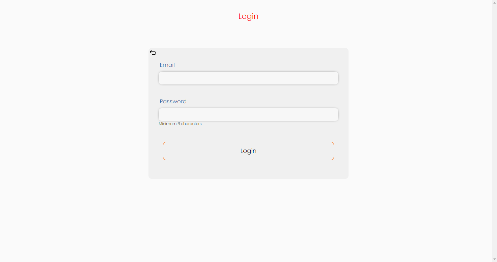

#ReadMe

## [Live-Server 👀](https://todo-wissem.netlify.app)



---

### Table of Contents 👋

You're sections headers will be used to reference location of destination.

- [Description](#description)
- [How To Use](#how-to-use)
- [References](#references)
- [License](#license)
- [Author Info](#author-info)

---

## Description 📄

Creating ReadMe's for your Github repository can be tedious. I hope this template can save you time and effort as well as provide you with some consistency across your projects.

#### Technologies 🛠️

- HTML 5
- CSS 3
- Java Script

[Back To The Top](#)

---

## How To Use 📙

#### Installation

#### API Reference

```html
<p>dummy code</p>
```

[Back To The Top](#)

---

## References 📋

[Back To The Top](#)

---

## License ©️

MIT License

Copyright (c) [2017]

Permission is hereby granted, free of charge, to any person obtaining a copy
of this software and associated documentation files (the "Software"), to deal
in the Software without restriction, including without limitation the rights
to use, copy, modify, merge, publish, distribute, sublicense, and/or sell
copies of the Software, and to permit persons to whom the Software is
furnished to do so, subject to the following conditions:

The above copyright notice and this permission notice shall be included in all
copies or substantial portions of the Software.

THE SOFTWARE IS PROVIDED "AS IS", WITHOUT WARRANTY OF ANY KIND, EXPRESS OR
IMPLIED, INCLUDING BUT NOT LIMITED TO THE WARRANTIES OF MERCHANTABILITY,
FITNESS FOR A PARTICULAR PURPOSE AND NONINFRINGEMENT. IN NO EVENT SHALL THE
AUTHORS OR COPYRIGHT HOLDERS BE LIABLE FOR ANY CLAIM, DAMAGES OR OTHER
LIABILITY, WHETHER IN AN ACTION OF CONTRACT, TORT OR OTHERWISE, ARISING FROM,
OUT OF OR IN CONNECTION WITH THE SOFTWARE OR THE USE OR OTHER DEALINGS IN THE
SOFTWARE.

[Back To The Top](#)

---

## Author Info ℹ️

### Created By Wissem Zidi 

### ✆ Want to contact Me?

- [Facebook](https://www.facebook.com/wissem.zidi.ofc/)
- [Messenger](https://msng.link/o/?wissem.zidi.ofc=fm)
- [Email](https://mail.google.com/mail/u/0/?fs=1&tf=cm&source=mailto&to=wissem.zidi.ofc@gmail.com)
- [Stack Overflow](https://stackoverflow.com/users/19135958/wissem)
- [Github](https://github.com/Wissem-Zidi/)
- [Whats App](https://wa.me/25561960?text=)

[Back To The Top](#)

**Have a nice day!** 🚀
